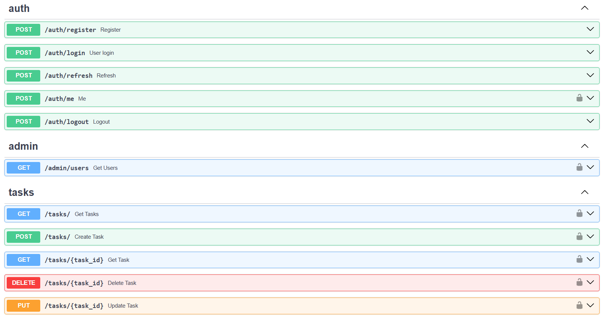
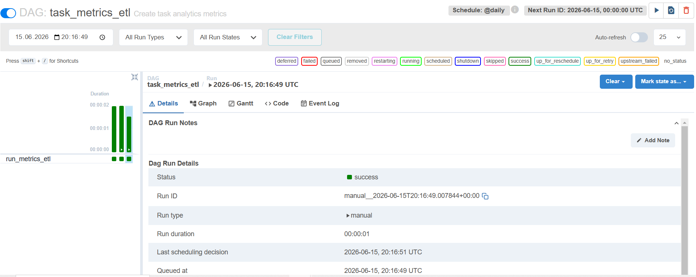

# Task Manager API & ETL Data Platform


Production-like backend and data engineering project built with FastAPI, PostgreSQL, Docker and Apache Airflow.

The application allows users to manage tasks through REST API and processes task data using an automated ETL pipeline.

---

## Project Status

✅ Backend completed  
✅ Dockerized infrastructure  
✅ Airflow ETL pipeline implemented  
✅ Automated tests passing  
✅ CI pipeline enabled

## ETL Data Flow

1. Airflow triggers DAG
2. Extract task data from PostgreSQL
3. Transform raw records using Pandas
4. Calculate metrics
5. Load analytics data back into PostgreSQL

---


## Tech Stack

### Backend
- Python 3.11
- FastAPI
- SQLAlchemy ORM
- Pydantic v2
- PostgreSQL
- JWT Authentication
- Redis
- Alembic

### Security
- JWT Authentication
- Access & Refresh Tokens
- Password hashing (bcrypt)
- Token blacklist
- Role Based Access Control (RBAC)
- User permissions

### Data Engineering
- Apache Airflow
- ETL Pipeline
- Pandas
- SQL Analytics

### DevOps & Quality
- Docker
- Docker Compose
- Redis
- GitHub Actions CI
- Pytest
- Structured JSON logging
- Request tracing

---

# Architecture

The project follows a layered architecture pattern with separation of responsibilities.

```
                  Client
                    |
                    v
              FastAPI API
                    |
                    v
              PostgreSQL
                    |
                    |
        +-----------+------------+
        |                        |
        v                        v
 Application data          Airflow DAG
                                  |
                                  v
                            ETL Pipeline
                                  |
                                  v
                         Analytics Tables
```

Additional components:

- Redis → rate limiting and token blacklist
- Middleware → request logging and tracing
- GitHub Actions → automated testing

📌 Detailed architecture diagram:

[View architecture](docs/architecture.md)
---

# Project structure:

```
Task-Manager-API/

├── backend/
│   ├── api/
│   ├── core/
│   ├── models/
│   ├── repositories/
│   ├── services/
│   └── tests/
│
├── analytics/
│   └── etl/
│
├── airflow/
│   └── dags/
│
├── docker-compose.yml
├── Dockerfile
└── README.md
```
--- 

# Authentication

The API uses JWT authentication.

Login returns:

```json
{
  "access_token": "...",
  "refresh_token": "...",
  "token_type": "bearer"
}
```

Access tokens protect private routes.

Refresh tokens allow creating new access tokens.

---

# RBAC Authorization

Admin endpoints are protected:

Example:

``` GET /admin/users ```

Permissions:
```
User	        Result
Anonymous	    401 Unauthorized
User	        403 Forbidden
Admin	        200 OK
```
--- 

# API Endpoints

## Auth

| Method | Endpoint |
|---|---|
| POST | /auth/register |
| POST | /auth/login |
| POST | /auth/refresh |


## Tasks

| Method | Endpoint |
|---|---|
| GET | /tasks |
| GET | /tasks/{id} |
| POST | /tasks |
| PUT | /tasks/{id} |
| DELETE | /tasks/{id} |


## Admin

| Method | Endpoint |
|---|---|
| GET | /admin/users |


---

## Features

### API

- User registration
- JWT authentication
- CRUD operations for tasks
- Admin authorization
- Error handling
- Logging

### Database

- PostgreSQL relational database
- SQLAlchemy ORM
- Repository pattern

### ETL Pipeline

Airflow automatically runs a data pipeline:

Extract:
- reads task data from PostgreSQL

Transform:
- calculates task metrics

Load:
- saves analytics results


---

## Docker services

Project runs using Docker Compose:

Services:

- FastAPI API
- PostgreSQL database
- Redis
- Apache Airflow


Run:

```bash
docker compose up -d
```
Check containers:

```bash
docker compose ps
```
Expected:

- api running
- postgres healthy
- redis running
- airflow running

---

## API Documentation

Swagger:

```
http://localhost:8000/docs
```

---

## Airflow

UI:

```
http://localhost:8080
```


Example DAG:

```
task_metrics_etl
```

---

## Tests


Run:

```bash
pytest
```

Current status:

```
12 tests passed
```

---

## Screenshots

### Swagger API




### Airflow DAG



---

## Future Improvements

- Kafka event streaming
- Data warehouse integration
- dbt transformations
- Monitoring with Prometheus/Grafana
- Kubernetes deployment

---

## Author

Natalia Kurek

LinkedIn:
[www.linkedin.com/in/natalia-kurek-b46660308](http://www.linkedin.com/in/natalia-kurek-b46660308)