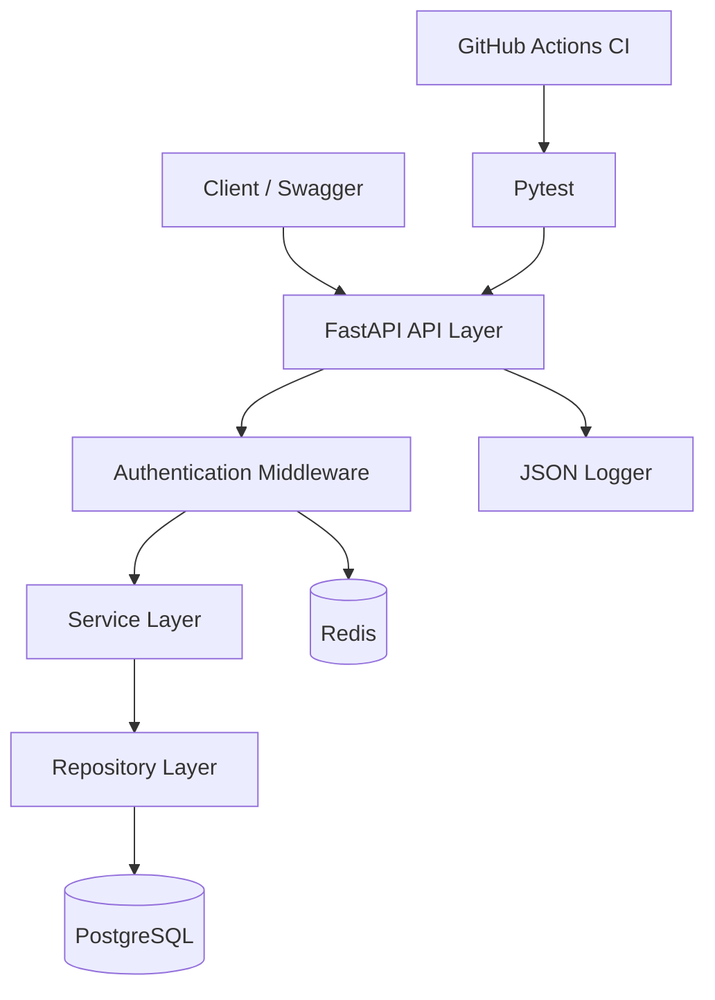

# Architecture

```mermaid

flowchart TD

    A[Client / Swagger] --> B[FastAPI API Layer]

    B --> C[Authentication Middleware]

    C --> D[Service Layer]

    D --> E[Repository Layer]

    E --> F[(PostgreSQL)]

    C --> G[(Redis)]

    B --> H[JSON Logger]

    I[GitHub Actions CI] --> J[Pytest]

    J --> B

```
